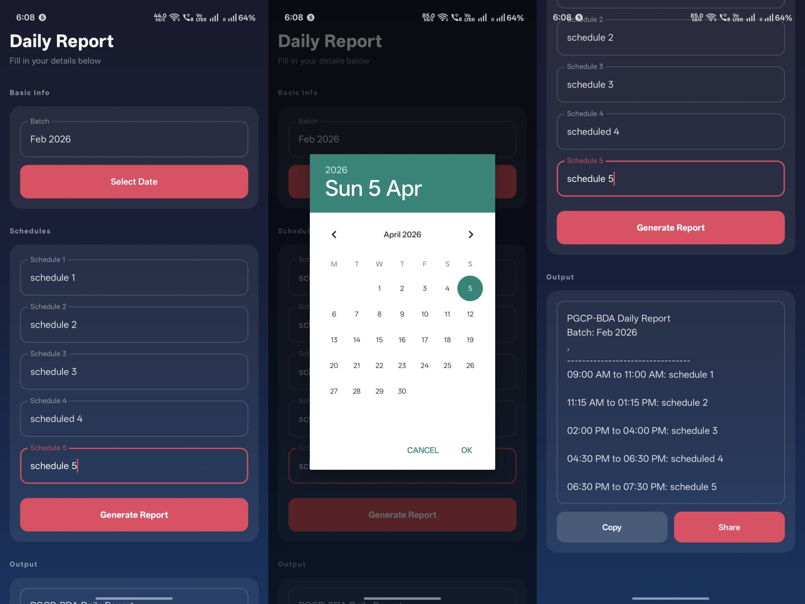

# Daily Report Scheduler

A simple Android app to fill, generate, and share your daily training reports — fast.

---

## What it does

- Fill in your **batch, date, and 5 schedule slots**
- Tap **Generate Report** → get a formatted report instantly
- **Copy** or **Share** it via WhatsApp, Email, etc.

## New in this version

| Feature | Detail |
|---|---|
| Auto-save | Your draft is saved automatically — never lose your work |
| Version History | App saves a snapshot every time you exit; tap the clock icon to browse past versions |
| Restore | Tap any past version to instantly reload all fields |
| Clear Form | One tap to wipe all fields and start fresh |
| Copied! | Toast confirmation when you copy the report |

## Tech

Kotlin · Jetpack Compose · Material 3 · SharedPreferences

## Usage

1. Open the app → fields auto-fill from your last session
2. Edit as needed → Tap **Generate Report**
3. Copy or Share

---

Built for personal use by **Sahil Karande**
